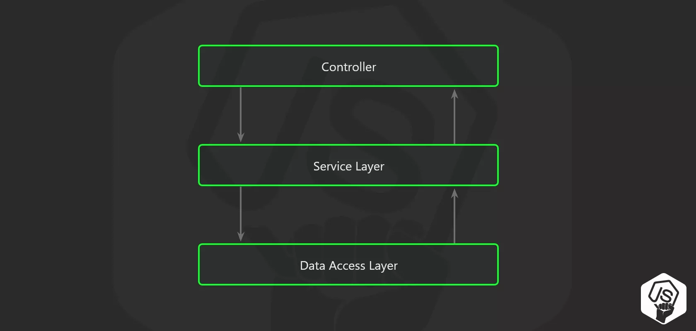

# 😊 bulletproof-node.js-project-architecture-ko (Korean Version)

> Santiage Quinteros 의 "Bulletproof node.js project architecture" 를 기반하여 한글버전으로 doc를 작성한다.

## 서론

Express.js는 Node.js REST API를 만들기위한 좋은 프레임워크이다. 그러나 당신이 Node.js Project를 구성할 때 어떠한 **단서**도 주지않는다.

대수롭지않게 넘어갈 수도 있지만, Santiage는 이를 "Real Problem"으로 말을 했다.

당신의 Node.js 프로젝트 구조의 정확한 설계는 그냥 좋은 습관으로 여겨지면 안된다. 그 것은 **"Game-change"** 로써, 판도를 뒤바꿀 포인트라는 것이다.정확한 설계를 하는 것은 코드의 중복을 방지하고 안정성을 높이며 서비스 확장 가능성을 열어준다.

해당 Document는 Santiage Quintero 라는 개발자가 수년간 경험하고 연구한 결과물을 기반으로 작성된다.

## 폴더 구조 🏢

### 일반적인 형태의 구조

본 필자는 아래와 같은 폴더구조를 지향한다. (무조건적인것은 아님. 설계방식에 따라 달라질 수 있음)

```
    src
    | app.js
    | server.js
    ├─api
    |  └─ controllers
    |  └─ middlewares
    |  └─ routes
    ├─config
    ├─jobs
    ├─loaders
    ├─models
    ├─services
    └─subscribers
```

### 폴더 설명

| 요소          | 설명                                                                    |
| ------------- | ----------------------------------------------------------------------- |
| `app.js`      | Application 진입점                                                      |
| `server.js`   | Server configuration and setup.                                         |
| `api`         | Application의 모든 엔드 포인트에 대한 route controller                  |
| `config`      | 환경 변수 및 구성 관련 파일                                             |
| `jobs`        | Application에서 주기적이거나 특정 이벤트에 따라 실행되는 작업 정의 관리 |
| `loaders`     | 시작 프로세스 모듈로 분리                                               |
| `models`      | 데이터베이스 모델과 스키마                                              |
| `services`    | 모든 비즈니스 로직이 포함된 파일                                        |
| `subscribers` | 비동기 작업을 위한 이벤트 핸들러                                        |

이는 파일을 깔끔하게 하는 것 이상의 의미를 가진다.

## 3 Layer architecture 🥪

해당 아이디어는 principle of separation of concerns(관심사 분리 원칙)을 활용하여 Node.js API 라우트에서 비즈니스 로직을 분리한다.



### 비즈니스 로직을 Controllers에 넣지말자

Express.js Controller에 비즈니스 로직을 포함하는 것은 편리할 수도 있다. 하지만 이는 스파게티 코드가 될 수 있는 지름길이다. 또한 Unit Test를 작성해야할 때는 복잡한 Mock 객체들을 다루어야 할 가능성이 높다.

또한, 클라이언트에게 응답을 보낸 후에도 추가적인 처리를 해야 할 경우가 있는데, 이런 상황을 적절하게 제어하기 어려울 수도 있다.

아래에 **나쁜 예시**를 알아보자.(본 저자의 코드와 약간의 차이가 있을 수도 있음)

```javascript
route.post('/', async (req, res, next) => {

  const userRequestDTO = req.body;
  const isUserValid = validators.user(userRequestDTO)
  if(!isUserValid) {
    return res.status(400).end();
  }

  // 수 많은 비즈니스 로직을 포함함.
  const userRecord = await UserModel.create(userDTO);
  delete userRecord.password;
  delete userRecord.salt;
  const companyRecord = await CompanyModel.create(userRecord);
  const companyDashboard = await CompanyDashboard.create(userRecord, companyRecord);

  ...whatever...


  // 이 부분이 최적화라면 모든 것을 엉망으로 만듬.
  // 클라이언트에게 응답을 보냄.
  res.json({ user: userRecord, company: companyRecord });

  // 계속 진행되는 코드
  const salaryRecord = await SalaryModel.create(userRecord, companyRecord);
  eventTracker.track('user_signup',userRecord,companyRecord,salaryRecord);
  intercom.createUser(userRecord);
  gaAnalytics.event('user_signup',userRecord);
  await EmailService.startSignupSequence(userRecord)
});
```

## 비즈니스 로직은 Service Layer에 넣자 💼

## Pub/Sub Layer도 사용하자 🎙️

## DI(Dependency Injection) 💉

## Unit Test는 선택이 아닌 필수 🕵️‍♂️

## Cron 작업과 반복적인 작업 ⏰

## 설정과 Secrets ⚙️

## 로더 🏗️
